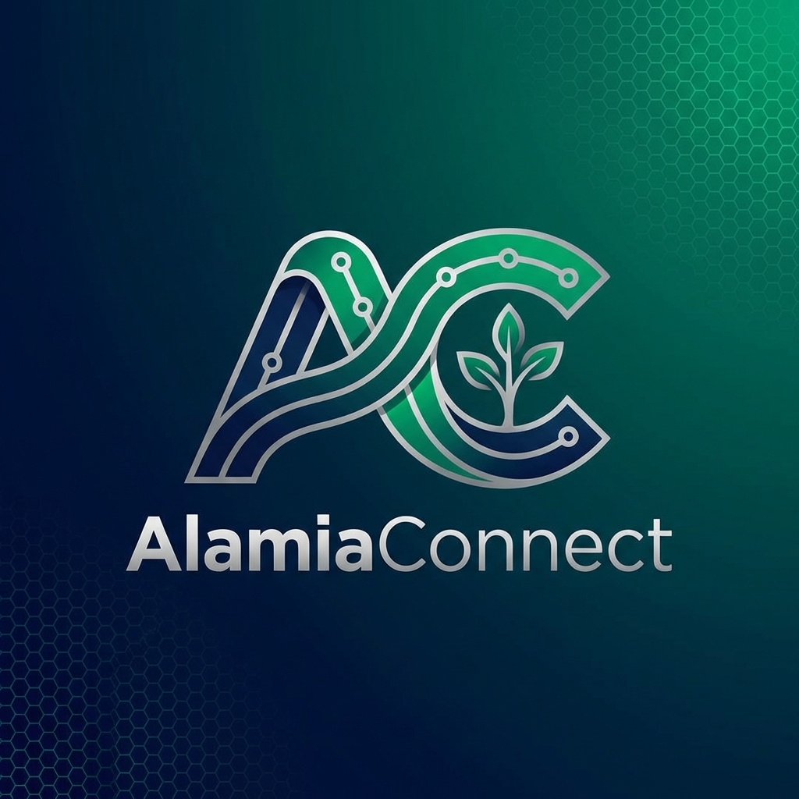

# 

# AlamiaConnect Docker

## Introduction

**AlamiaConnect** is a CRM framework designed for modern businesses. Built on top of industry-leading open-source technologies like [Laravel](https://laravel.com) and [Vue.js](https://vuejs.org), it provides a robust foundation for customer lifecycle management.

**Empower your SME or Enterprise with a complete, open-source CRM solution.**

---

*   **Customer Lifecycle Management**: Seamlessly manage leads, customers, and opportunities.
*   **Unified Next.js & Laravel Architecture**: A modern, high-performance decoupled architecture.
*   **Dockerized Environment**: Quick and consistent deployment using Docker.
*   **Highly Extensible**: Modular architecture allows for easy customization.
*   **Modern Tech Stack**: Laravel 10+, PHP 8.4, Next.js 15, and MySQL.

---

### Prerequisites

*   **Docker** & **Docker Compose** installed on your system.
*   **Git** for cloning the repository.

---

### Installation

1.  **Clone the repository**:
    ```bash
    git clone https://github.com/alamiaconnect/docker-setup.git
    cd docker-setup
    ```

2.  **Run the setup script**:
    The setup script handles container creation, database initialization, and application setup.
    ```bash
    sh setup.sh
    ```

---

### Service Configuration

The setup uses `docker-compose.yml` to orchestrate several services:

- **AlamiaConnect App**: PHP 8.3 & Apache
- **Database**: MySQL 8.0
- **Cache**: Redis 6.2
- **Email Testing**: MailHog
- **Database Management**: phpMyAdmin

| Service | Local Port |
| :--- | :--- |
| Web Application | [http://localhost](http://localhost) |
| phpMyAdmin | [http://localhost:8080](http://localhost:8080) |
| MailHog | [http://localhost:8025](http://localhost:8025) |

---

### After Installation

Log in to the admin panel using the default credentials:

*   **URL**: `http://localhost/admin/login`
*   **Email**: `admin@example.com`
*   **Password**: `admin123`

---

### Support

For support and documentation, please visit our official channels or reach out via our support portal.

---

### Documentation & Guides

- [**Multi-Tenant Deployment (Gold Standard)**](docs/multi_tenant_deployment.md) - **Start Here!**
- [**Next.js Frontend Blueprint**](docs/nextjs_deployment_preview.md) - Future proofing frontends.
- [CloudPanel Setup](docs/cloudpanel_setup.md) - Secondary proxy config.
- [CI/CD & GHCR Guide](docs/ghcr_portainer_setup.md) - How automation works.
- [Planned Improvements](docs/improvements.md) - Roadmap for infra.

---
© 2026 AlamiaConnect. All rights reserved.
